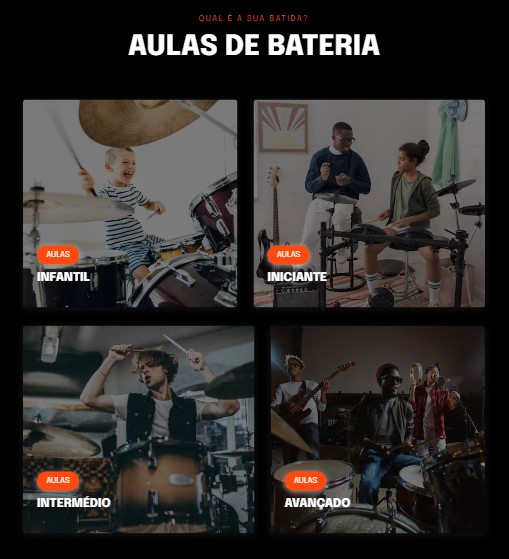

# drum-grid 🥁

### VERSÃO MOVÉL ###

  

### VERSÃO DESKTOP ###

  

### PROJETO EM PRODUÇÃO 🚧 ##

Esse é meu primeiro projeto pensando em "Responsividade".

Iniciei usando o método Mobile first (Primeiro a versão móvel)📱

- para melhor funcionamento do layout em telas diferentes, usei medidas relativas, ex:(1.3rem).

_________________________________________________________________________________________

No formato para Tablet e Desktop utilizei o "display:grid" para o posicionamento dos cards...
_________________________________________________________________________________________
## SOBRE O PROJETO

- Esse projeto tratasse de um fragmento de um site, aonde o usuário pode ter acesso aos níveis das aulas. 

### IMPLEMENTAÇÕES FUTURAS 

- Informações do conteúdo de cada módulo.

- Botão para contato (WhatsApp).
